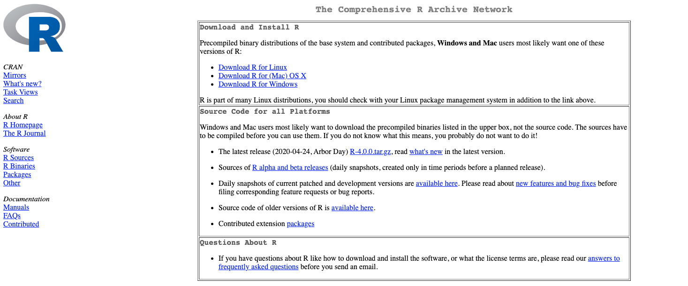
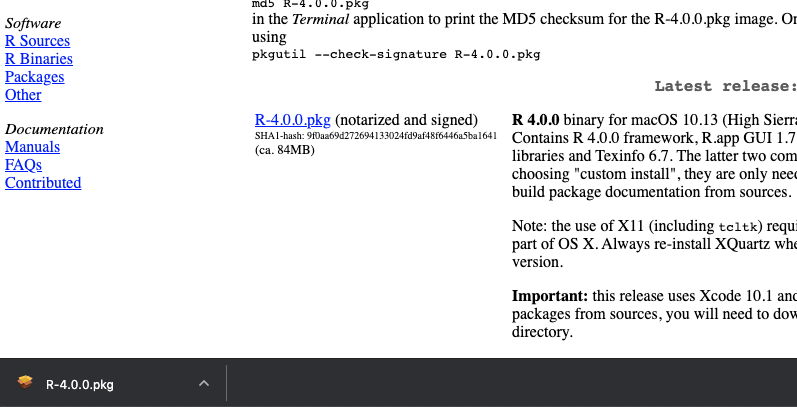
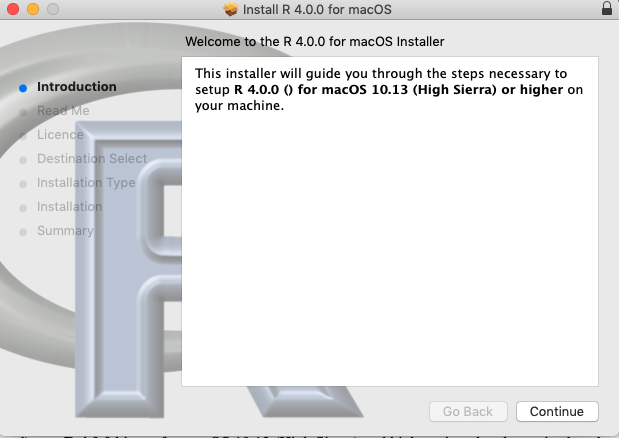
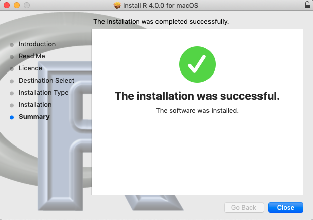
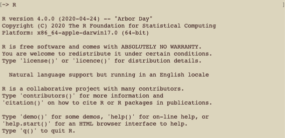
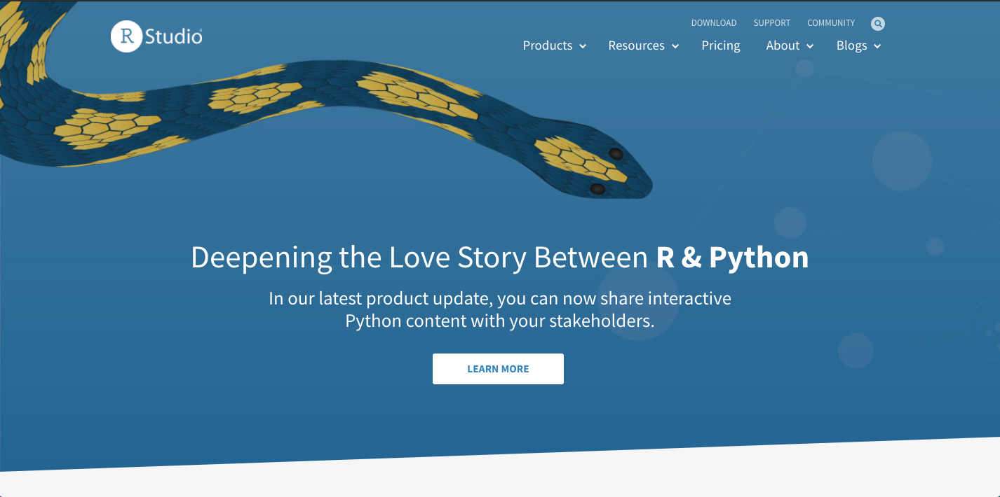

# Installing R 

## Introduction

In this lesson we'll get R installed on your computer and begin to get you familiar with [RStudio](https://rstudio.com/), a data science IDE that many useRs like! 

## Objectives

By the end of this lesson, you should be able to:

* [ ] Have base R installed on a computer
* [ ] Have Rstudio installed on their computer
* [ ] Install the tidyverse !!!!!!!!!!!!!! 
* [ ] Change color scheme of RStudio 
* [ ] Disable RStudio's default saving of .RData 
* [ ] Run your first RMarkdown script

## Getting R 

Over the course of the next few lessons we **won't** be running R in your browser, but rather putting it on your local machine.
You might already have some software that could run R, but in order to make sure everything works please be sure to follow these steps exactly so everything works well!
This is especially true of you try to use the RStudio that comes along with [Anaconda](https://www.anaconda.com/); it's best to just do a fresh install of both R and RStudio.
Luckily R tends to be much easier to install and manage than Python. 

So where do you get all things R?
The most up-to-date version of R can always be found on The Comprehensive R Archive Network or [CRAN](https://cran.r-project.org/).
If you navigate to `https://cran.r-project.org/` you will see this page here:



Follow the links in the top box of `Download and Install R` to get R on your computer.
The following series of screenshots will show what this process looks like if you're doing this as of May 2020 on an OSX system. 

After you click `Download R for (Mac) OS X`, you should then see this image below:

<div style="text-align:center"></div>

If you then click on the where it says `R-4.x.x.pkg`, R will download on your computer. 



You'll notice that R downloads pretty fast if you're on a decent internet connection.
R `4.0.0` is only requires about 170MB. 

If you then open up the package that is downloaded (Chrome shown here), you can just follow the install instructions in the install wizard 




You can verify that R has been installed by opening up your terminal and typing in `R`.



Try to type in somehing simple like:

```{r}
2 + 2
```

into the console.
It will look something like this: 


It works like a calculator just like Python! 

To exit type: 

```{r}
quit()
```

Then tell it `n` for no saying you don't want to save your workspace! 

Now unless you're some sort of masochist, you're never going to actually run R from your terminal for your data science projects. 
We need to get an IDE to help us out!


## RStudio

Just like Python, there are many ways to interact with R as a programming language.
One of the most popular choices at the moment, for reasons that will be made clear very soon, is [RStudio]().
It can be a bit confusing when getting into the world of R because [RStudio](https://rstudio.com/products/rstudio/download/) the IDE is created by [RStudio PBC](https://rstudio.com/) the company.
As a fun fact, RStudio the company just announced that it is now a Public Benefit Corporation meaning that "corporate decisions must both align with this mission, as well as balance the interests of community, customers, employees, and shareholders".
That's not super relevant to our install, but if you do talk to anyone in the R world, this was a very big deal.
You can read more about it [here](https://blog.rstudio.com/2020/01/29/rstudio-pbc/). 

So how do we get RStudio the IDE?
Let's navigate over to `RStudio.com` and again follow this set of install instructions.


* r-install-8.png 


Now if you're following these install instructions near May of 2020, you'll notice that RStudio's homepage is actually sshowing off a recent push that the company has been doing to have RStudio be able to run Python!
You can read more about that [here at this link](https://blog.rstudio.com/2020/04/02/rstudio-connect-1-8-2/).

But let's not get distracted! 
If you go from the home page and hover over products you can get a link to find where to get RStudio


* r install 9 

From here we want to get RStudio for desktop 

* r install 10


Clicking this will take you down the page to this next image where you actually get RStudio

* r install 11


We of course want the free one!

* R install 12 


And this takes you to where all the versions of RStudio live.

* R install 13.png


We can install Rstudio with just dragging and dropping on OSX.


* r intall 14

Once this has been installed with the drag and drop, we just double click to open up Rstudio.

## RStudio IDE 

RStudio is the GUI for all things R.
When you first open RStudio, typically you will see four separate panels.

On the top left is your script editor where you write your code, on the bottom left you have your console where your code gets run.
On the top right you see the environment-- something we'll talk about soon-- and then on the bottom right we see our Viewer. 
You can change the positions of this if you'd like and [can find instructions to do that here]() and can also change the color schemes of your editor if you navigate to `HERE>` on OSX.

Let's first try that 

* install r-13


Now while we're here in Preferences, let's also do something that's goign to save you a lot of pain in the long run which is UNTICK the save data 

* install r 14


Alright, let's now close this out and try to run somethign!

## Running a Script

Now we've done a lot here to get both R and RStudio installed and set up here, let's end with running one script!
In this local repository for this lesson, you'll find a folder called `my first r run`.

First, clone this repo to your local machine with the following commands.

```
git clone www.github.com/learn-co-curriculum/installing-r.git
```

Then `cd` into the directory and open the `.Rproj` file in there.

```
cd installing-r
open installing-r.rproj
```

Doing this will open up another RStudio on your computer.
The .Rproj file basically walls off the rest of your comptuer so RStudio thinks the entire universe of your project lives within this area.
Using .Rproj files helps eliminate absolute paths and makes it so it's a lot easer to get your R code to run on others computers.

With this file open, if you then go to where it says `Files` in the bottom right panel and then click "Tips Coverter.Rmd" you will open up your first RMarkdown file (the Juypter notebook of R).


This file contains the data and narrative we will be using the next few lessons.
We'll describe it more at the start of the next lesson!

With this open, let's just click where it says `Knit` at the top to see what happens.


* install 15

This will run the RMarkdown script and create a little report for you. 
Notice it's an HTML file of your analysis meaning you can now just put the `file.html` that was just created on any website! 
RMarkdown allows data scientists to make quick reports in HTML, LaTeX, or even Word formats.
We just wanted to show off this cool tool before working in R. 


 
